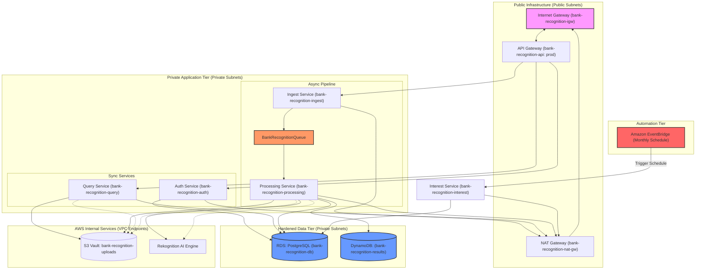

# 🏛️ Recognition Vault — Enterprise Infrastructure

> High-Performance, AI-Secured Financial Ecosystem powered by AWS CloudFormation.

The platform is engineered as a **Monorepo**, housing the React-based frontend and Python-based serverless backend in a unified repository to ensure atomic updates and seamless CI/CD integration.

---

## 📜 Infrastructure Deployment Strategy (CloudFormation)

The entire infrastructure is managed as **Infrastructure as Code (IaC)** using **AWS CloudFormation**. The architecture follows a strict modular approach, where each tier is deployed as a specialized standalone stack:

1.  **Networking Stack (`bank-recognition-networking`)**: Provisioning the `bank-recognition-vpc`, Public/Private subnets, `NAT Gateway`, `Internet Gateway`, and `security groups`.
2.  **Persistence Stack (`bank-recognition-storage`)**: Provisioning the S3 vault.
3.  **Database Stack (`bank-recognition-database`)**: Provisioning the RDS and DynamoDB results table.
4.  **Automation Stack (`bank-recognition-automation`)**: Provisioning SQS queues and **Amazon EventBridge** rules.
5.  **Compute Stack (`bank-recognition-compute`)**: Deploying serverless microservices (Lambda).
6.  **API Gateway Stack (`bank-recognition-api`)**: Exposing endpoints to the frontend.

### 🏷️ Naming & Compliance Standards
To meet enterprise audit requirements, every resource in this platform follows a **strict naming convention**. All physical resources and stacks must be prefixed with **`bank-recognition-`**. This ensures clear ownership and resource grouping within the AWS Management Console.


---

## 🏗️ System Architecture (Topology)



---


## 🌐 The Network Backbone (VPC & Routing)

The entire digital perimeter of the Recognition Vault is established within a highly resilient Virtual Private Cloud (VPC) named **`bank-recognition-vpc`**, utilizing the **`192.168.0.0/16`** CIDR architecture. To ensure zero-latency and maximum isolation, the network is segmented into two distinct layers. The Public Tier, hosting `bank-recognition-public-subnet-1` (192.168.1.0/24) and `bank-recognition-public-subnet-2` (192.168.2.0/24), acts as the primary gateway for inbound traffic through the **`bank-recognition-igw`** (Internet Gateway). Traffic in this zone is managed by the **`bank-recognition-public-rt`** (Public Route Table), which ensures direct connectivity for the **`bank-recognition-nat-gw`**.

The core business logic and sensitive financial data are strictly confined to the Private Tier, which comprises `bank-recognition-private-subnet-1` (192.168.3.0/24) and `bank-recognition-private-subnet-2` (192.168.4.0/24). All outbound traffic from these subnets is intelligently routed by the **`bank-recognition-private-rt`** (Private Route Table) through the NAT Gateway, providing a secure, one-way exit for updates and API calls. This architecture ensures that the compute resources and database remain entirely invisible and unreachable from the public internet.

### Security Groups (Firewall Logic)
To govern the flow of data between these tiers, we implement a stateful firewall strategy using Security Groups. The **`bank-recognition-lambda-sg`** acts as the primary shield for all compute resources, allowing outgoing connections for API processing while blocking unauthorized inbound attempts. Complementing this, the **`bank-recognition-rds-sg`** (RDS Security Group) is configured with a strict ingress rule that only permits traffic on port 5432 originating from the Lambda security group, ensuring that the database remains invisible to all other resources within the VPC. This granular "Chain of Trust" ensures that even if one layer is compromised, the data tier remains fortified.


---

## 🗄️ The Data Persistence Tier (RDS & DynamoDB)

For structured financial accounting and high-integrity ledgers, we utilize an Amazon RDS PostgreSQL instance named **`bank-recognition-db`**. This relational database is the "Source of Truth" for all user balances, transaction history, and encrypted card numbers. Running on **PostgreSQL Engine v15** with **20GB of gp2 storage**, the instance is configured for high reliability. The primary administrator account is set to **`bankadmin`** with the password **`LKSCloud2027smakengo`**, ensuring controlled access during deployment. By placing this database within the private subnets, we ensure that the core bank ledger is protected by multiple layers of network security.


Complementing the relational store, an Amazon DynamoDB table named **`bank-recognition-results`** provides a high-performance NoSQL layer for storing raw AI detection metadata and audit trails. This table is structured with a **Partition Key (`imageId`)** and a **Sort Key (`timestamp`)** to allow for fast, granular retrieval of recognition results. This dual-database strategy allows the platform to handle structured financial data with ACID compliance while maintaining a fast, flexible log of AI processing results from Rekognition.


---

## 📩 The Resiliency Layer (SQS)

In a high-stakes banking environment, processing heavy image payloads and performing multi-row database updates can lead to request timeouts and data loss. To mitigate this, you must provision an Amazon SQS queue named **`BankRecognitionQueue`**. This service acts as the asynchronous backbone of the vault, allowing the Ingest service to immediately acknowledge a user's request while the backend "Vault Engine" processes the transaction in a durable, retry-able manner. By utilizing this producer-consumer pattern, we ensure that no liquidity injection or fund transfer is ever lost due to temporary database contention or network spikes.

---

## ⏲️ The Automation Heartbeat (Amazon EventBridge)

To ensure the continuity of financial operations, the platform utilizes **Amazon EventBridge** as its serverless scheduling engine. A rule named **`bank-recognition-interest-schedule`** is provisioned to trigger the Interest Service on a recurring basis (e.g., `rate(30 days)`). This automation replaces manual payroll or interest disbursement processes, ensuring that every account holder receives their liquidity rewards accurately and on time, regardless of manual administrative activity.

---

## 🗃️ The Biometric Vault (S3 Storage)

All sensitive biometric identity data is stored within an Amazon S3 bucket named **`bank-recognition-uploads`**. This bucket acts as a secure storage vault for high-resolution face reference images used during identity verification. For maximum security, **CORS (Cross-Origin Resource Sharing) is strictly disabled** on this bucket. Since the platform utilizes the backend Ingest Service to handle all image transmissions, there is no requirement for the frontend to communicate with S3 directly, effectively neutralizing any potential browser-based cross-origin attacks. Access to the biometric data is governed solely by internal VPC endpoints, ensuring image data never traverses the public internet when being retrieved by the Rekognition AI engine or the Query service.


---

## ⚡ The Compute Engine (Lambda & Layers)

The application logic is powered by a suite of AWS Lambda functions running on the **Python 3.12** runtime. These functions are designed to be stateless and highly scalable, handling everything from biometric mapping to interest calculation. 

**Crucially, to enable database connectivity, you must attach a Lambda Layer containing the `psycopg2-binary` library.** This layer is mandatory because the standard AWS Lambda environment does not include native PostgreSQL drivers; without this layer, the functions will be unable to execute SQL commands against the RDS instance. Each function is tuned with specific memory profiles—ranging from 256MB for light query tasks to 1024MB for heavy AI processing.

| Function Name | Memory | Timeout | Handler | Description |
|---------------|--------|---------|---------|-------------|
| `bank-recognition-auth` | 256MB | 30s | `index.lambda_handler` | Handles secure sessions and DB seeding. |
| `bank-recognition-ingest` | 1024MB | 60s | `index.lambda_handler` | Producer: Dispatches tasks to the SQS Queue. |
| `bank-recognition-processing`| 512MB | 120s| `index.lambda_handler` | Consumer: Executes Rekognition and DB writes. |
| `bank-recognition-query` | 512MB | 30s | `index.lambda_handler` | Real-time balance and biometric sync. |

---

## 🛣️ The Traffic Entry Point (API Gateway)

All external communication with the vault is governed by an AWS API Gateway instance named **`bank-recognition-api`**. This regional REST API is configured with multiple resources and methods to expose the platform's features to the React frontend. The gateway is deployed using a permanent **`prod`** stage which enables high-performance throttling and CORS headers for secure browser interactions.

| Resource Path | Method | Integration | Description |
|---------------|--------|-------------|-------------|
| `/login` | `POST` | `auth-service` | Authenticates users and generates session tokens. |
| `/register` | `POST` | `auth-service` | Creates new user profiles and generates card numbers. |
| `/me` | `GET` | `query-service` | Fetches real-time profile, balance, and biometric status. |
| `/verify-face` | `POST` | `query-service` | Synchronous 1:1 face comparison against S3 reference. |
| `/transfer` | `POST` | `ingest-service` | Queues a fund transfer task to the Vault Engine. |
| `/deposit` | `POST` | `ingest-service` | Queues a liquidity injection task for processing. |
| `/register-face` | `POST` | `ingest-service` | Enqueues a face registration/mapping task. |

### 🧪 API Testing Guide (Postman / Insomnia)

To test the platform's features, use the following JSON request bodies in your API client. Ensure the `Content-Type` header is set to `application/json`.

#### 1. User Authentication
**POST `/register`**
```json
{
  "username": "jane_doe",
  "password": "SecurePassword123",
  "full_name": "Jane Doe"
}
```

**POST `/login`**
```json
{
  "username": "jane_doe",
  "password": "SecurePassword123"
}
```

#### 2. Banking Operations (Ingest)
*Note: These operations are processed asynchronously via SQS.*

**POST `/deposit`**
```json
{
  "token": "YOUR_SESSION_TOKEN",
  "amount": 50000
}
```

**POST `/transfer`**
```json
{
  "token": "YOUR_SESSION_TOKEN",
  "recipient_card": "1234567890123456",
  "amount": 25000
}
```

#### 3. Biometric Identity
**POST `/register-face`**
```json
{
  "token": "YOUR_SESSION_TOKEN",
  "image_data": "data:image/jpeg;base64,/9j/4AAQ..."
}
```

**POST `/verify-face`**
```json
{
  "username": "jane_doe",
  "image_data": "data:image/jpeg;base64,/9j/4AAQ..."
}
```

#### 4. Real-time Sync
**GET `/me`**
- **Header**: `Authorization: YOUR_SESSION_TOKEN`
- **Body**: None


---

## 💻 Frontend Deployment (Amplify)

The **AWS Amplify** web hosting is managed **manually via the AWS Console** under the application name **`bank-recognition-frontend`**. Because this project follows a **Monorepo** structure, you must explicitly enable the monorepo settings during the initial setup in the Amplify Console. This ensures that the build engine correctly identifies the `frontend/` directory as the root for the React application, allowing for independent CI/CD cycles while keeping the backend infrastructure declarations in the same repository. This approach provides a seamless automated deployment experience every time the master branch is updated.


---

## 📂 Project Structure

```bash
bank-recognition/
├── frontend/             # High-fidelity React application
├── lambda/               # Service-oriented logic (Auth, Ingest, Proc, Query)
└── README.md             # Enterprise System Documentation
```
